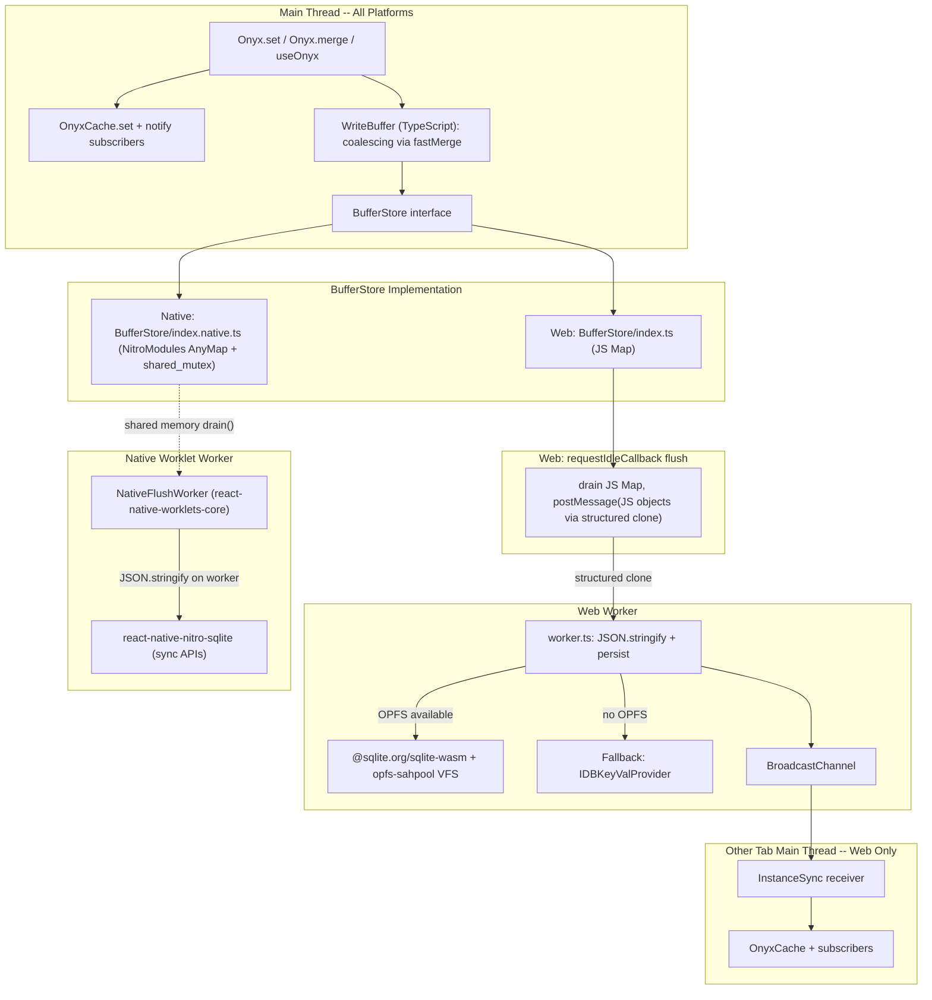

# Proposal: Multi-Threaded Storage Engine for react-native-onyx

## Problem Statement

Onyx is the client-side data persistence and state management layer used across the Expensify App on all platforms (web, iOS, Android). It provides an offline-first, reactive key-value store that synchronizes with the backend.

The current storage architecture has several problems that become increasingly costly at scale:

### 1. The read-merge-write pattern is expensive for merge operations

`Onyx.merge()` is the most common write operation in the app. On IndexedDB (web), each merge follows a read-merge-write cycle: read the full JSON blob, deserialize it, deep-merge the patch, re-serialize, and write the full blob back. For large objects (e.g. a report with hundreds of actions), this means reading and writing potentially hundreds of KB even when the patch is only a few bytes.

### 2. Every write blocks the main thread and hits storage immediately

When a write is issued, the storage call is made immediately. While IndexedDB itself is asynchronous, the JS thread still bears the cost of serializing the data and managing the transaction. Rapid successive writes to the same key each independently go through this full cycle, even when intermediate values are never read back.

### 3. Divergent storage implementations across platforms

On iOS and Android, Onyx uses SQLite via `react-native-nitro-sqlite`. On web, it uses IndexedDB (`idb-keyval`). The native implementation has separate SQL queries, and web has no SQL at all. Bug fixes and optimizations apply to one platform but not the other.

### 4. No shared code between platforms

The native and web storage providers are completely separate codebases. This duplication makes maintenance expensive and means improvements must be implemented twice.

---

## Proposed Solution

This refactor introduces a **multi-threaded storage engine** with a symmetric "JS worker thread" pattern on both platforms. The architecture has three layers:

### Layer 1: WriteBuffer (TypeScript, Main Thread, All Platforms)

A `WriteBuffer` sits between Onyx's cache layer and the storage provider. It intercepts all writes and stages them in memory before flushing to the persistence layer in batches.

The WriteBuffer tracks two types of pending entries per key:
- **`SET` entries**: Full value replacements. A new `SET` replaces any pending entry entirely.
- **`MERGE` entries**: Patch deltas. Successive merges are coalesced via `fastMerge`. A merge after a SET applies the patch to the full value in-memory.

The WriteBuffer's backing data structure is modular via the `BufferStore` interface:
- **Web**: `BufferStore/index.ts` -- a simple JS `Map`. On flush, entries are serialized and sent to a Web Worker via `postMessage`.
- **Native (iOS/Android)**: `BufferStore/index.native.ts` -- a NitroModules `HybridObject` wrapping a mutex-protected C++ `AnyMap`. JS objects are converted to `AnyValue` via NitroModules' `JSIConverter` at zero-copy cost (no `JSON.stringify` on the main thread). A Worklet Worker Runtime drains this shared buffer, serializes entries on the background thread, and persists via SQLite.

Read-through ensures cache consistency: pending `SET` entries are served from memory; pending `MERGE` entries trigger a flush before reading from the provider.

### Layer 2: Shared SQL Queries + Official SQLite Packages

Rather than maintaining a custom C++ SQLite wrapper and WASM build, we leverage **official, battle-tested SQLite packages**:

- **Web**: `@sqlite.org/sqlite-wasm` with `opfs-sahpool` VFS for OPFS-backed persistence
- **Native (iOS/Android)**: `react-native-nitro-sqlite` with synchronous APIs for maximum throughput from the worker thread

Both platforms share a single source of truth for all SQL queries: `SQLiteQueries.ts`. This file contains all `CREATE TABLE`, `INSERT`, `UPDATE`, `DELETE`, and `PRAGMA` statements.

Key SQL operations:
- `SET`: `REPLACE INTO keyvaluepairs (record_key, valueJSON) VALUES (?, json(?));`
- `MERGE`: `INSERT ... ON CONFLICT DO UPDATE SET valueJSON = JSON_PATCH(valueJSON, JSON(?));` (atomic, no read-merge-write)
- `REMOVE`: `DELETE FROM keyvaluepairs WHERE record_key = ?;`
- Batch writes execute in a single transaction for atomicity

### Layer 3: Symmetric JS Worker Threads

Both platforms use a dedicated JS background thread for persistence, achieving a symmetric architecture:

**Web:** A standard Web Worker (`lib/storage/worker.ts`) receives batched writes from the main thread via `postMessage`. It dynamically imports either `@sqlite.org/sqlite-wasm` (for OPFS-capable browsers) or `IDBKeyValProvider` (fallback for older browsers). After persisting, the worker broadcasts value-bearing messages over `BroadcastChannel` for cross-tab sync.

**Native (iOS/Android):** A `react-native-worklets-core` Worker Runtime (`lib/storage/NativeFlushWorker.ts`) runs on a background JS thread. It periodically drains the shared `HybridObject` buffer (shared memory, no `postMessage` overhead), `JSON.stringify`s the entries off the main thread, and calls `react-native-nitro-sqlite`'s synchronous APIs to persist to SQLite.

### Cross-Tab Synchronization (Web Only)

After persisting a batch, the worker broadcasts **value-bearing messages** over `BroadcastChannel('onyx-sync')`. `InstanceSync` on each receiving tab's main thread handles incoming messages:
- `set`: `onStorageKeyChanged(key, value)` directly -- no storage read
- `merge`: `fastMerge(cachedValue, patch)` against the local cache (fallback to `provider.getItem` if not cached)
- `remove`: `onStorageKeyChanged(key, null)`
- `clear`: notify all cached keys with null

---

## Architecture Overview



### Data Flow: Native (iOS/Android)

```
JS Main Thread                              Worklet Worker Runtime
--------------                              ----------------------
Onyx.set(key, value)
  -> cache.set(key, value)
  -> subscribers notified
  -> writeBuffer.set(key, value)
    -> [TS coalescing via fastMerge]
    -> bufferStore.set(key, entry)
      -> [NitroModules fromJSI: AnyValue conversion, NOT JSON]
      -> [C++: shared_mutex unique_lock, insert, unlock]
  -> return (fire-and-forget)
                                            ...flush interval fires...
                                            drain() shared HybridObject buffer
                                              -> [C++: shared_mutex unique_lock, swap, unlock]
                                            [NitroModules toJSI: AnyValue -> JS objects]
                                            JSON.stringify entries (on worker thread!)
                                            nativeSQLiteProvider.multiSet() (sync API)
                                            nativeSQLiteProvider.multiMerge() (sync API)
```

### Data Flow: Web

```
Main Thread                                 Web Worker
-----------                                 ----------
Onyx.set(key, value)
  -> cache.set(key, value)
  -> subscribers notified
  -> writeBuffer.set(key, value)
    -> [TS coalescing via fastMerge]
    -> jsMap.set(key, entry)
  -> return (fire-and-forget)

  ...requestIdleCallback fires...
  -> writeBuffer.flushNow()
    -> drain JS Map
    -> postMessage(JS objects)              onmessage (structured clone)
                                            JSON.stringify entries (on worker!)
                                            provider.multiSet(batch)
                                            provider.multiMerge(batch)
                                            BroadcastChannel.postMessage({type, values})
```

---

## Key Files

### Shared SQL Queries

| File | Description |
|------|-------------|
| `lib/storage/providers/SQLiteQueries.ts` | Single source of truth for all SQL: CREATE TABLE, INSERT, UPDATE, DELETE, PRAGMA. Used by both web and native SQLite providers. |

### C++ (Native Only)

| File | Description |
|------|-------------|
| `cpp/NativeBufferStore.h` / `.cpp` | `std::shared_mutex`-protected `AnyMap` HybridObject. Pure buffer -- no threading, no SQLite. Provides `set`, `get`, `drain`, `entries`, `clear`. |
| `cpp/CMakeLists.txt` | CMake build for the NativeBufferStore library and its tests |
| `cpp/test_native_buffer_store.cpp` | Unit tests for thread-safe buffer operations |

### TypeScript (Shared)

| File | Description |
|------|-------------|
| `lib/storage/WriteBuffer.ts` | Write coalescing with pluggable `BufferStore` and `FlushScheduler` |
| `lib/storage/BufferStore/types.ts` | `BufferStore` interface |
| `lib/storage/BufferStore/index.ts` | Web: JS `Map` wrapper |
| `lib/storage/BufferStore/index.native.ts` | Native: NitroModules HybridObject (with JS Map fallback) |
| `lib/storage/index.ts` | Main storage API with WriteBuffer integration |

### Web Worker

| File | Description |
|------|-------------|
| `lib/storage/worker.ts` | Unified web worker: dynamically loads SQLite WASM or IDB backend, handles all storage ops, broadcasts value-bearing cross-tab messages |
| `lib/storage/WorkerStorageProvider.ts` | Main-thread proxy: postMessage-based request/response to the worker |
| `lib/storage/providers/SQLiteProvider/index.web.ts` | `@sqlite.org/sqlite-wasm` with `opfs-sahpool` VFS, prepared statements |

### Native Worker

| File | Description |
|------|-------------|
| `lib/storage/NativeFlushWorker.ts` | `react-native-worklets-core` Worker Runtime: periodic drain + JSON.stringify + nitro-sqlite persistence |
| `lib/storage/providers/SQLiteProvider/index.native.ts` | `react-native-nitro-sqlite` with synchronous APIs for worker-thread usage |
| `lib/storage/platforms/index.native.ts` | Wires HybridObject BufferStore with NativeFlushWorker |

### Cross-tab sync

| File | Description |
|------|-------------|
| `lib/storage/InstanceSync/index.web.ts` | BroadcastChannel receiver: handles value-bearing set/merge/remove/clear messages |

---

## What Gets Replaced (from baseline)

| Old | New |
|-----|-----|
| Single-threaded IDB writes on main thread | WriteBuffer + Web Worker with batched persistence |
| Key-only cross-tab broadcasts (requiring storage reads) | Value-bearing BroadcastChannel messages |
| Platform-divergent SQL queries | Shared `SQLiteQueries.ts` |
| No write coalescing | `WriteBuffer` with SET/MERGE entry coalescing via `fastMerge` |

## What Gets Kept

| File | Reason |
|------|--------|
| `react-native-nitro-sqlite` | Official native SQLite package, called from worker thread |
| `@sqlite.org/sqlite-wasm` | Official web SQLite WASM package with OPFS VFS |
| `lib/storage/providers/IDBKeyValProvider/` | Retained as fallback for browsers without OPFS |
| `lib/OnyxCache.ts` | In-memory cache stays in JS on the main thread |
| `lib/storage/InstanceSync/index.web.ts` | Receiver unchanged, already handles value-bearing messages |
| `lib/storage/providers/types.ts` | `StorageProvider` interface stays |

## New Dependencies

| Package | Purpose | Scope |
|---------|---------|-------|
| `react-native-worklets-core` | Background JS Worker Runtime for native platforms | Peer dependency (native only) |

---

## Benchmarking

Benchmarks run in **real browser environments** (headless Chromium via Playwright) using Vitest in browser mode with tinybench. Data generators create production-realistic Expensify data (reports, transactions) at four scale tiers (50, 250, 1000, 5000 keys).

The unified architecture will be benchmarked against the current implementation on all three platforms (web, iOS, Android) to validate performance gains from:
- Write coalescing (reducing total storage operations)
- Off-main-thread JSON serialization (native)
- Batched SQLite transactions
- Value-bearing cross-tab broadcasts (eliminating redundant reads)

---

## How to Build

### Native (iOS/Android) -- C++ Buffer Tests

```bash
cd cpp
mkdir -p build && cd build
cmake .. -DBUILD_TESTING=ON
make -j8
./native_buffer_store_test    # Thread-safe buffer tests
```

### TypeScript Tests

```bash
npm install
npm test
```

### Benchmarks

```bash
# Run benchmarks in headless Chromium
npx vitest bench --run --config vitest.bench.config.ts --outputJson bench-results/current.json

# Generate comparison report
npx tsx scripts/generateBenchReport.ts bench-results/baseline.json bench-results/current.json --open
```

---

## Future Optimizations

### Glaze-based JSON Serialization in a Native C++ Worker Thread

The current architecture performs `JSON.stringify` in the Worklet Worker Runtime (a JS background thread). A further optimization would be to move JSON serialization entirely into C++ using [Glaze](https://github.com/stephenberry/glaze), a high-performance C++ JSON library.

This would enable:
1. **True native C++ worker thread** (not a JS runtime) for persistence
2. **Zero-copy JSON serialization** from `AnyValue` to SQLite-ready strings in C++
3. **Shared C++ worker code across all platforms** -- including web via WASM compilation
4. **Elimination of `react-native-nitro-sqlite`** in favor of a direct C++ SQLite wrapper using the SQLite C API, enabling a single SQLite provider implementation for iOS, Android, and web

This optimization was deferred because it requires:
- Building and maintaining a custom SQLite WASM module with Emscripten (including OPFS VFS)
- Writing C++ bindings for `AnyValue` to Glaze's reflection system
- More complex build toolchain (Emscripten SDK for web, CMake for native)

The current architecture is designed to make this migration straightforward: the `SQLiteQueries.ts` file already defines all SQL as platform-agnostic constants, and the `BufferStore` HybridObject pattern cleanly separates the buffer from the persistence layer.

---

## Open Questions

1. **`react-native-worklets-core` compatibility**: Verify the Worklet Worker Runtime can access `react-native-nitro-sqlite` synchronous APIs and that the NitroModules HybridObject is accessible from the worker context.
2. **AnyValue thread safety with NitroModules**: Confirmed that `AnyValue` is a deep-copied C++ value type, safe to pass between threads. The `NativeBufferStore` uses `std::shared_mutex` for concurrent access (shared locks for reads, unique locks for writes).
3. **`flushNow()` on shutdown**: On native, `flushNow()` synchronously drains and executes SQL. On web `beforeunload`, verify time budgets.
4. **OPFS availability**: Modern browsers support OPFS; the architecture gracefully falls back to IDB when OPFS is unavailable.
5. **Nitro module packaging**: Standalone package vs embedded in `react-native-onyx`.
